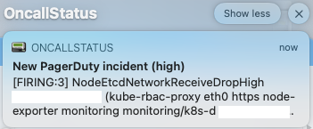
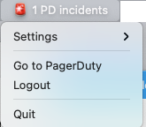
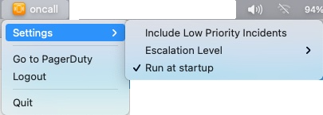

# oncall-status

A [PagerDuty](https://www.pagerduty.com/) utility app to show if you're oncall and notifies you when a new incident has been triggered.

  [](https://github.com/mtougeron/oncall-status/releases)

## Installation

From the [releases page](https://github.com/mtougeron/oncall-status/releases) download the latest DMG file, open it, and drag the `OncallStatus.app` to the `/Applications` folder.

## Functionality

### Notifications

For each new incident you'll receive a notification that is clickable and will take you to the incident page.



### Number of incidents

The menu bar is updated to show the number of active incidents.



### Settings

The settings menu let's you configure the notification statuses. For example, what escalation level it should track or whether or not to include low priority incidents.



## Basic build & test

```
make build && cp -a OncallStatus.app /Applications
```

## Build & sign a release

The signing & notarizing with Apple uses [`gon`](https://github.com/mitchellh/gon).

### Automation

This will create a release and upload the sign & notarized application to the release page.

```
git tag -a v#.#.# -m "<release notes>"
git push origin v#.#.#
```

### Local testing

To test locally you can run the following `make` commands. The `gon-[app,dmg].hcl` files currently are hardcoded to my `bundle_id`.

`make build` -- Build the application binary

`make sign-app` -- Sign the application binary. Must set `AC_USERNAME` & `AC_PASSWORD` environment variables to work.
If you are testing outside of the main application the `bundle_id` inside of `gon-app.hcl` will need to be changed as well.

`make dmg` -- Create the DMG for the application

`make notarize-dmg` -- Notarize the DMG with Apple. Must set `AC_USERNAME` & `AC_PASSWORD` environment variables to work.
If you are testing outside of the main application the `bundle_id` inside of `gon-dmg.hcl` will need to be changed as well.
